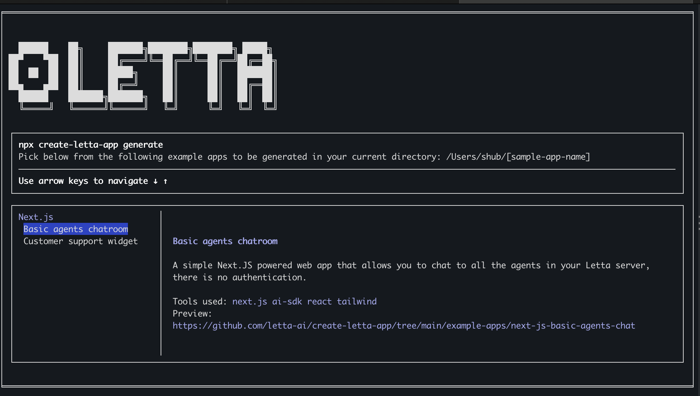

# Create Letta App
`create-letta-app` allows you to create applications that use Letta. It provides a simple and easy way to get started with Letta and build applications that leverage its capabilities.

## Usage
You can start using `create-letta-app` by running the following command:

```bash
npx create-letta-app@latest
```
